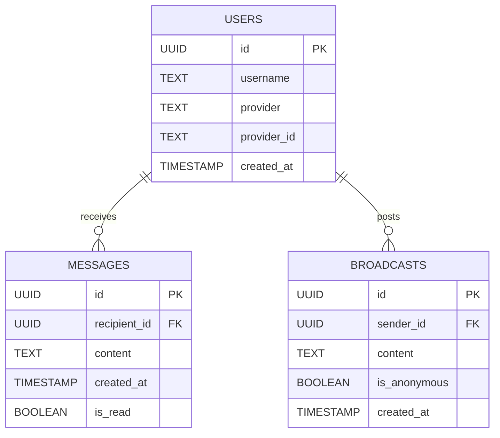

# System Architecture

## Overview

Anonyma employs a monorepo structure integrating a high-performance Rust backend with a Next.js frontend, designed for type safety and reliability.

## Technology Stack

| Component | Technology | Description |
|-----------|------------|-------------|
| **Backend** | Rust + Axum | High-performance, memory-safe API server. |
| **Auth** | Authkestra | OAuth2 (GitHub) and secure session management. |
| **Database** | PostgreSQL | Relational persistence managed via SQLx. |
| **Frontend** | Next.js | React framework for modern web interfaces. |

## Database Schema

## Security Design

### Authentication
The system uses the OAuth 2.0 Authorization Code flow with GitHub as the provider.
1. Users authenticate via GitHub.
2. The backend exchanges the code for a token.
3. A secure, HTTP-only session cookie is issued to the client.

### State Management
- **Backend**: Uses distinct state isolation. `AuthkestraState` manages authentication logic, while `Extension<PgPool>` provides database access, merged into a single Axum router.
- **Frontend**: React hooks manage local UI state and API integration.

## CI/CD Pipeline

Automated workflows validate code quality on every push:
- **Rust**: Format checks (`cargo fmt`), linting (`cargo clippy`), and automated testing (`cargo test`).
- **TypeScript**: Static analysis (`npm run lint`) and type checking (`tsc`).
