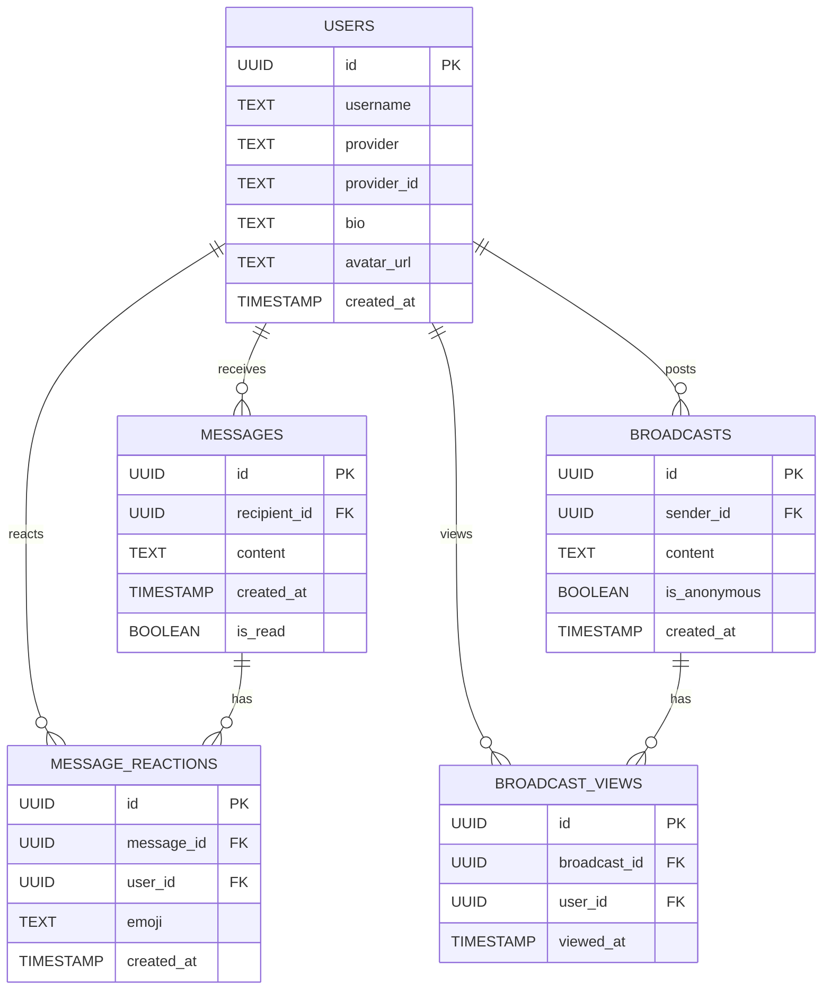

# System Architecture

## Overview

Anonyma employs a monorepo structure integrating a high-performance Rust backend with a React (Vite) frontend, designed for speed, type safety, and maximum user privacy.

## Technology Stack

| Component | Technology | Description |
|-----------|------------|-------------|
| **Backend** | Rust + Axum | High-performance, memory-safe API server. |
| **Auth** | Authkestra | OAuth2 (GitHub) and secure session management. |
| **Database** | PostgreSQL | Relational persistence managed via SQLx. |
| **Frontend** | React (Vite) | Modern web interface with Tailwind CSS and shadcn/ui. |

## Database Schema

## Security Design

### Anonymity First
The core design principle is that the Sender ID of a P2P message is never recorded in the messages table. This ensures cryptographic-level anonymity for the sender, as there is no database link between the message and its origin.

### Authentication
The system supports both local credentials and GitHub OAuth 2.0. Secure, HTTP-only session cookies are used to maintain agent state without exposing tokens to the client-side JavaScript.

### Real-time View Tracking
Broadcast views are tracked once per agent using an IntersectionObserver on the frontend, ensuring that Read Receipts are accurate and non-intrusive.

## CI/CD and Maintenance

- **Backend**: cargo clippy and cargo test.
- **Frontend**: eslint and vitest.
- **Database**: Versioned migrations via SQLx.
