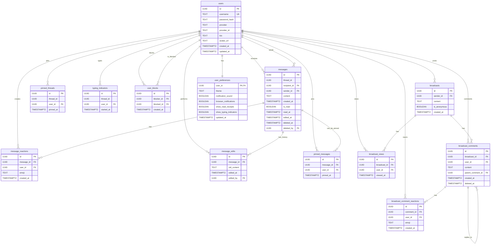

# System Architecture

## Overview

Anonyma is built as a modern web application with a Rust backend and React frontend, designed for performance, type safety, and user privacy. The system employs a client-server architecture with real-time communication capabilities via Server-Sent Events.

## Technology Stack

### Backend
- **Language**: Rust
- **Web Framework**: Axum 0.8
- **Database**: PostgreSQL 14+
- **ORM**: SQLx with compile-time query verification
- **Authentication**: Authkestra (GitHub OAuth2 and local credentials)
- **Real-time**: Server-Sent Events (SSE)
- **Logging**: Tracing framework
- **Session Storage**: In-memory (MemoryStore)

### Frontend
- **Framework**: React 18 with Vite
- **Language**: TypeScript
- **Styling**: Tailwind CSS
- **UI Library**: shadcn/ui
- **State Management**: TanStack Query v5
- **Animations**: Framer Motion
- **Icons**: Lucide React
- **Emoji Picker**: emoji-picker-react

## System Components

### Backend Services

**API Server**
- RESTful API endpoints for all operations
- Session-based authentication with HTTP-only cookies
- Request validation and error handling
- Structured logging and monitoring
- CORS configuration for frontend communication

**Real-time Service**
- Server-Sent Events for live updates
- Typing indicator broadcasting
- Message delivery notifications
- Broadcast view tracking
- Read receipt updates

**Background Tasks**
- Typing indicator cleanup (10-second intervals)
- Removes stale typing indicators older than 10 seconds
- Runs automatically on server startup

### Frontend Application

**Core Pages**
- Landing page with authentication options
- Login page with local credentials and GitHub OAuth
- Inbox with conversation management and search
- User discovery and profiles
- Broadcast board with comments
- Settings and preferences
- Blocked users management

**Real-time Features**
- Live message updates via SSE
- Typing indicators with animated dots
- Read receipts with timestamps
- Browser and audio notifications
- Automatic reconnection on connection loss

## Database Schema

### Entity-Relationship Diagram



### Table Descriptions

**users**
- Stores user accounts for both local and OAuth authentication
- `provider` field indicates authentication method ('local' or 'github')
- `provider_id` stores external OAuth provider user ID
- `password_hash` is nullable for OAuth-only users

**messages**
- Stores peer-to-peer messages with threading support
- `thread_id` groups all messages in a conversation
- `sender_id` stored server-side but never exposed to recipients
- `is_read` and `read_at` track message read status
- Soft deletion via `deleted_at` and `deleted_by`

**broadcasts**
- Public messages visible to all users
- `is_anonymous` flag allows posting without revealing identity
- `sender_id` can be null for anonymous broadcasts

**typing_indicators**
- Ephemeral table for real-time typing status
- Automatically cleaned up by background task
- Unique constraint prevents duplicate indicators per thread

### Indexes

Strategic indexes for optimal query performance:

**messages table:**
- `messages_thread_id_idx` - Thread-based lookups
- `messages_recipient_id_idx` - User inbox queries
- `messages_sender_id_idx` - Sent messages queries
- `messages_content_search_idx` - Full-text search (GIN index)

**broadcasts table:**
- `broadcasts_created_at_idx` - Chronological ordering
- `broadcasts_sender_id_idx` - User's broadcasts

**Other indexes:**
- Foreign key indexes for join performance
- Unique constraints for data integrity
- Timestamp indexes for time-based queries

## Security Architecture

### Authentication Flow

**Local Authentication:**
1. User submits username and password via POST /auth/register or /auth/login
2. Backend validates credentials (minimum 6 characters for password)
3. Password hashed with Argon2 before storage
4. Session created with secure, HTTP-only cookie
5. Cookie sent to client for subsequent requests

**GitHub OAuth:**
1. User clicks "Authenticate via GitHub"
2. Redirected to GitHub authorization page
3. User approves application access
4. GitHub redirects back with authorization code
5. Backend exchanges code for access token
6. User profile fetched from GitHub API
7. User created or updated in database
8. Session created and cookie sent to client

### Session Management

- Sessions stored in-memory via Authkestra MemoryStore
- HTTP-only cookies prevent JavaScript access
- Secure flag disabled for localhost development
- Session includes user identity and provider information
- Automatic session validation on protected routes

### Anonymity Preservation

The system maintains sender anonymity through architectural design:

**Message Flow:**
1. Sender creates message with recipient ID
2. Backend stores sender_id in database
3. API response to recipient excludes sender_id
4. Recipient sees "Anonymous Agent" as sender
5. Reply routing uses thread_id to find original sender
6. Sender identity never exposed in API responses

**Database Level:**
- Sender IDs stored for reply routing
- API layer filters sender data from responses
- Recipients cannot query sender information
- Thread-based routing maintains conversation flow

### Data Protection

- **Password Security**: Argon2 hashing with salt
- **XSS Prevention**: HTTP-only session cookies
- **CSRF Protection**: Session validation on state-changing operations
- **SQL Injection**: Prepared statements via SQLx
- **Input Validation**: Request validation on all endpoints
- **Soft Deletion**: Audit trail preservation

## Communication Patterns

### Request-Response (HTTP)

Standard REST API for:
- Authentication operations (login, register, logout)
- Message CRUD operations
- User profile management
- Broadcast creation and retrieval
- Preference updates

### Server-Sent Events (SSE)

Unidirectional real-time updates:

**Connection Establishment:**
1. Client connects to GET /api/sse after authentication
2. Backend validates session
3. Connection stored in notification hub (HashMap)
4. Keep-alive messages sent periodically

**Event Types:**
- `new_message` - New message received
- `message_reaction` - Reaction added to message
- `typing` - User typing in conversation
- `read_receipt` - Message read by recipient
- `new_broadcast` - New broadcast posted

**Event Payload:**
```json
{
  "event_type": "new_message",
  "data": "{\"message_id\":\"...\",\"thread_id\":\"...\"}"
}
```

### Data Flow Examples

**Sending a Message:**
1. Client: POST /api/messages with recipient_id and content
2. Backend: Validates session and input
3. Backend: Checks if sender is blocked by recipient
4. Backend: Stores message in database with thread_id
5. Backend: Sends SSE event to recipient if online
6. Backend: Returns success response to sender
7. Client: Updates UI optimistically

**Real-time Typing:**
1. Client: Detects user typing
2. Client: Debounces for 3 seconds
3. Client: POST /api/conversations/{thread_id}/typing
4. Backend: Stores typing indicator
5. Backend: Broadcasts SSE event to other participant
6. Client: Displays "User is typing..." indicator
7. Background task: Cleans up after 10 seconds

## Performance Considerations

### Backend Optimization

- **Asynchronous I/O**: Tokio runtime for concurrent request handling
- **Connection Pooling**: SQLx connection pool for database efficiency
- **Compile-time Verification**: SQLx validates queries at compile time
- **Zero-copy Parsing**: Efficient request deserialization with Serde
- **Structured Logging**: Minimal overhead with Tracing

### Frontend Optimization

- **Code Splitting**: Lazy loading of route components
- **Optimistic Updates**: Immediate UI feedback before server confirmation
- **Request Deduplication**: TanStack Query prevents duplicate requests
- **Automatic Caching**: Query results cached and invalidated intelligently
- **Debounced Input**: Search and typing indicators debounced

### Database Optimization

- **Strategic Indexing**: Indexes on frequently queried columns
- **Full-text Search**: GIN index for message content search
- **Foreign Key Indexes**: Efficient join operations
- **Connection Pooling**: Reused database connections
- **Prepared Statements**: Query plan caching

## Scalability

### Current Architecture

The application is designed for small to medium scale:
- Single backend server
- Single PostgreSQL instance
- In-memory session storage
- Direct SSE connections

### Horizontal Scaling Path

For larger scale deployment:

1. **Load Balancer**: Distribute traffic across multiple backend instances
2. **Sticky Sessions**: Route users to same backend for SSE connections
3. **Redis Session Store**: Shared session storage across instances
4. **Database Read Replicas**: Distribute read queries
5. **CDN**: Serve static frontend assets globally

### Vertical Scaling

Individual components can be scaled:
- Increase PostgreSQL resources (CPU, memory, storage)
- Add more CPU cores for concurrent request handling
- Expand memory for larger connection pools
- Optimize queries and indexes

## Monitoring and Observability

### Logging

Structured logging with Tracing framework:
- Request/response logging with timing
- Error tracking with stack traces
- Database query logging (optional)
- Authentication events
- Background task execution

### Metrics (Future)

Planned metrics collection:
- Request latency percentiles
- Database query performance
- Active SSE connections
- Error rates by endpoint
- User activity patterns

## Deployment Architecture

### Development Environment

- Local PostgreSQL instance
- Backend on localhost:3000
- Frontend on localhost:8080
- Hot reload for both services
- Debug logging enabled

### Production Environment

Recommended setup:
- PostgreSQL on managed database service (AWS RDS, DigitalOcean)
- Backend behind reverse proxy (nginx or Caddy)
- Frontend served as static files from CDN
- HTTPS with valid certificates
- Environment-based configuration
- Structured logging to aggregation service
- Automated backups

## Future Enhancements

### Planned Improvements

**Infrastructure:**
- Redis for session storage and caching
- WebSocket support for bidirectional communication
- Message queue for asynchronous processing
- Comprehensive monitoring dashboard

**Features:**
- End-to-end message encryption
- File attachment support
- Voice and video messages
- Advanced search with filters
- Message forwarding
- User presence indicators

**Scalability:**
- Microservices architecture for large scale
- Database sharding for horizontal scaling
- CDN integration for global distribution
- Rate limiting at application level

## Security Considerations

### Current Implementation

- Argon2 password hashing
- HTTP-only session cookies
- CSRF protection via session validation
- SQL injection prevention via prepared statements
- Input validation on all endpoints
- Soft deletion for audit trails

### Future Security Enhancements

- Rate limiting per user and IP
- Two-factor authentication
- Session management UI
- Security headers (CSP, HSTS)
- Audit logging for sensitive operations
- Automated security scanning
